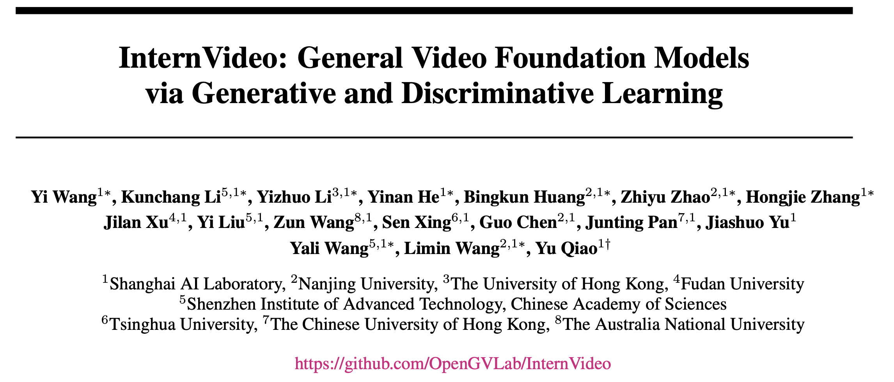
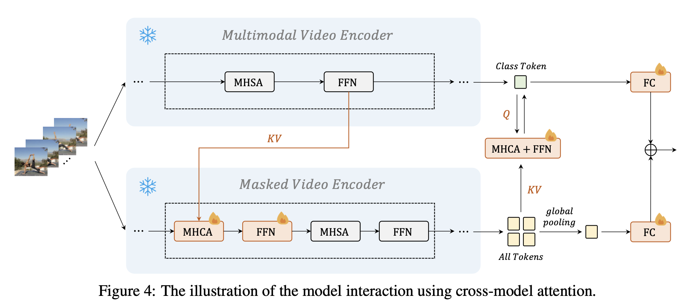
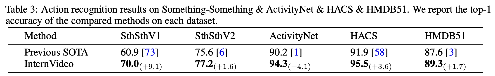
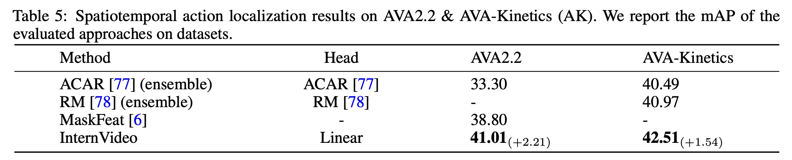
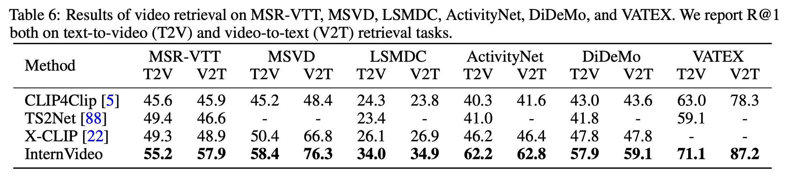

# InternVideo 论文笔记

Author: <a href="https://yusijin02.github.io/">Sijin Yu</a>

[TOC]

## 1. Information

>**标题**: InternVideo: General Video Foundation Models via Generative and Discriminative Learning
>
>**arXiv URL**: https://arxiv.org/abs/2212.03191
>
>**code**: https://github.com/OpenGVLab/InternVideo
>
>**发布时间**: 2022 年 12 月

## 2. Abstract

- **基础模型**最近在计算机视觉的各种下游任务中表现出优异的性能.
- 但是, 大部分现存的视觉基础模型都**只是简单地关注于图像水平的预训练**, **它们缺乏在动态且复杂的视频水平上的预训练**.
- 为了填补这一空白, **我们利用生成式、判别式自监督视频模型**, 提出一种通用的视觉模型, **InternVideo**.
- 具体地, InternVideo 使用了 **Masked Video Modeling** 和 **Video-language Contrasive Learning** 为预训练目标, 并以**可学习**的方式**有选择地协调这两个完整框架的视频表示**, 以增强各种视频下游应用.
- InternVideo 在 39 个视频数据集上达到了 SOTA, 包括视频动作识别/检测, 视频语言对齐, 开放世界视频应用. 我们的模型在 K400 和 SSV2 上分别达到了 91.1% 和 77.2% 的 top-1 准确率. 这些结果展现了 InternVideo 在视频理解上的泛化能力.

## 3. Model

### 3.1 Overview

- 使用两种**自监督**模型, 学习视频的表达: Masked Video Reconstruction 和 Multimodal Contrastive Learning.
- 使用 Cross Model Attention, 综合两个自监督模型的优点, 获取更好的**视频表达**.
- 在下游任务中针对性**有监督学习**.

### 3.2 Masked Video Encoder

- 使用 VideoMAE 作为 Encoder, ViT 作为 Decoder.

- Decoder 的通道数是 Encoder 的一半, 默认有四个 blocks.

- 对于一个**未**被 masked 的视频输入:

  - 在时间上下采样, 降低帧数.
  - 将视频在时间上分组, 分成不重叠的 3D patches 块.
  - 每个 3D patch 被**线性映射**到一个 **cube embedding (立方体嵌入)**. [⚠️注: cube embedding 是一个拥有三个维度的 embedding.]

  - 对这些 cube embedding, 使用 **tube masking**,  [⚠️注: 这是一种掩盖或遮挡部分嵌入值的方法, 只保留其中的一部分信息.] 使用高 masked 率 (如 90%).

### 3.3 Multimodal Video Encoder

- 使用 UniFormerV2 做 Video Encoder. [⚠️注: UniFormerV2 可见我的博客: <a href='https://blog.csdn.net/yusijinfs/article/details/133414339'>点击访问 UniFormer & UniFormerV2 论文笔记</a>.]
- 使用 **align-before-fuse 范式**:
  - 视频和文本分别编码.
  - 在 **align (对齐)** 阶段, 使用**对比学习损失**去对齐视频和文本的**嵌入空间**.
  - 在 **fuse (融合)** 阶段, 使用一个 **caption decoder (字幕解码器)** 作为跨模态融合器.

### 3.4 Cross Model Attention

- 只有红色部分是可训练的. 其余部分为 frozen.
- KV 表示 key 和 value, Q 表示 query.

### 3.5 预训练超参数设置

下图: 预训练的超参数设置.

下图: 预训练使用的数据集和采样设置.

## 4. Experiment & Result

### 4.1 与 SOTA 的对比

下图: [**Action Recongition 动作识别**] 在 K400/600/700 上的对比.

下图: [**Action Recongition 动作识别**] 在 SSV1/V2, ActivityNet, HACS, HMDB51 上的对比.

下图: [**Temporal Action Localization 时间动作定位**] 在 THUMOS-14, Activitynet-v1.3, HACS, FineAction 上的对比.

下图: [**Spatiotemporal Action Localization 时空动作定位**] 在 AVA2.2, AVA-Kinetics 上的对比.

下图: [**Video Retrieval 视频检索**] 在 MSR-VTT, MSVD, LSMDC, ActivityNet, DiDeMo, VATEX 上的对比.

下图: [**Video Question Answering 视频问答**] 在 MSRVTT, MSVD, TGIF 上的对比.

原文还做了不少其它的下游任务, 此处略.

下图: InternVideo 在多个下游任务、多个数据集上均达到了 SOTA.

## 5. Conclusion

主要贡献:

- 将此前的 UniFormerV2 和 VideoMAE 相结合, 设计了 Video Masked Model 和 Video-Language 对比学习.
- 在各种下游任务取得了非常好的成绩.
